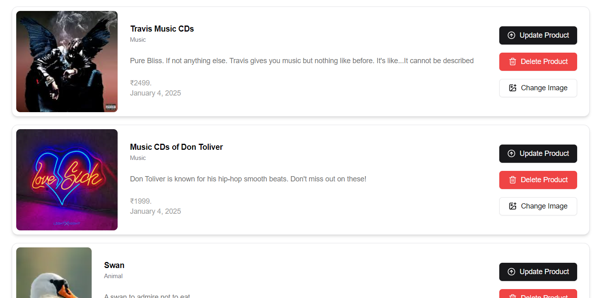

# Product Catalog Application  

A fully responsive, feature-rich product catalog application built with **Next.js**. This application allows authenticated users to browse, search, and manage products with pagination and CRUD operations.  

# Live Demo Link

https://productcatalog-pc.vercel.app/

## Features  

### 1. Authentication  
- **GitHub Authentication** integrated using **Auth.js**.  
- Users can log in with their GitHub accounts to manage products.  
- Secured routes to restrict access to authorized users.  


### 2. Product Management  
- Display a list of products with details like:  
  - Title  
  - Category  
  - Content/Description  
  - Price  
  - Created At timestamp  
  - Product Image  

   

### 3. Search Functionality  
- Users can search for products using keywords.  
- The search automatically fetches relevant results from the backend.  
- Pagination adapts to the number of search results, showing accurate page numbers.  


### 4. Pagination  
- Pagination implemented for browsing products.  
- Users can navigate between pages to view all products.  
- Pagination adjusts dynamically based on search results.


### 5. CRUD Operations  
- **Create**: Add new products to the catalog (requires additional components for forms).  
- **Read**: View product details in a responsive card-based layout.  
- **Update**:  
  - Update product details using the `UpdateProd` component.  
  - Update product images with the `UpdateImage` component.  
- **Delete**: Remove products from the catalog with a confirmation prompt. 


### 6. Loading States  
- A spinner (using **lucide-react** icons) is displayed during data fetches or other asynchronous operations.  

### 7. Responsive Design  
- Fully responsive UI with components designed for desktop and mobile layouts.  

### 8. Custom Reusable Components  
- **Card Components**: Display products with a clean design using components like `Card`, `CardHeader`, `CardFooter`, etc.  
- **Button Components**: Styled buttons for actions like navigation, deletion, and updates.  

### 9. Error Handling  
- Handles errors during data fetching, deletion, or other operations gracefully.  
- Alerts users with appropriate messages when operations fail.  

## Technologies Used  

- **Next.js**: For building the React-based frontend.  
- **Auth.js**: For implementing GitHub authentication.  
- **React Hooks**: To manage state and lifecycle (`useState`, `useEffect`).  
- **Lucide-react**: For beautiful, customizable icons like `Loader2Icon` and `Trash2Icon`.  
- **CSS/Utility Classes**: For styling and responsive design.  
- **Fetch API**: For asynchronous calls to the backend API.  

## Project Structure  

```struct
├── components  
│   ├── ui/  
│   │   ├── button.tsx      # Custom Button component  
│   │   ├── card.tsx        # Card components  
│   ├── UpdateImage.tsx     # Component to update product images  
│   ├── UpdateProd.tsx      # Component to update product details  
├── helpers/  
│   ├── helpers.ts          # Utility functions like `toProperTime`  
├── pages/  
│   ├── api/  
│   │   ├── auth/           # Auth.js configuration for GitHub login  
│   │   ├── product/        # Backend API for handling CRUD operations  
│   ├── index.tsx           # Main page for displaying the product catalog  
├── public/  
│   ├── images/             # Static assets (e.g., placeholders, icons)  
├── styles/                 # Global and module CSS files  

``` 

## Installation  

### Clone the Repository  

```copy
git clone https://github.com/your-username/product-catalog.git  
cd product-catalog  
```

```copy
npm install
```
### Configure GitHub Authentication  

1. **Create a GitHub OAuth App**:  
   - Go to [GitHub Developer Settings](https://github.com/settings/developers).  
   - Create a new OAuth app and note the **Client ID** and **Client Secret**.  
   - Set the callback URL to: `http://localhost:3000/api/auth/callback/github`.  

2. **Add the Credentials to Environment Variables**:  
   Create a `.env.local` file in the root of the project and add the following:  
   ```env
   GITHUB_ID=your_github_client_id  
   GITHUB_SECRET=your_github_client_secret  
   NEXTAUTH_URL=http://localhost:3000  
    ```
```copy
npm run dev
```

## Open the Application 
    - Open your browser and navigate to http://localhost:3000.

